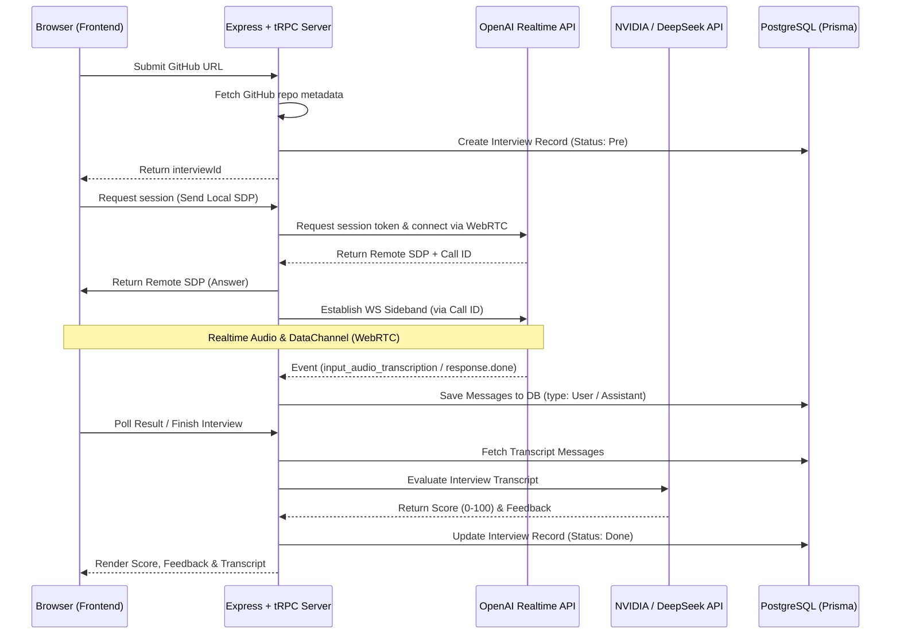

# Echo AI Interviewer

An AI-powered technical interviewer that conducts real-time voice-based computer science interviews. Echo AI customizes questions dynamically based on the candidate's GitHub profile, and provides interactive scoring and feedback using modern AI models.

---

## 📖 External Documentation & Guides

> [!NOTE]
> The following documentation resources were referenced during the development of this project:

- **OpenAI Realtime WebRTC Guide**: [https://developers.openai.com/api/docs/guides/realtime-webrtc](https://developers.openai.com/api/docs/guides/realtime-webrtc)
- **OpenAI Realtime Server Controls Guide**: [https://developers.openai.com/api/docs/guides/realtime-server-controls](https://developers.openai.com/api/docs/guides/realtime-server-controls)

---

## 🚀 Key Features

- **Dynamic Onboarding**: Analyzes the candidate's public GitHub repositories and tailors the interview questions to their actual experience and stack.
- **Real-Time Voice Chat**: Employs **OpenAI Realtime API (WebRTC)** to provide high-quality, ultra-low latency audio communication directly inside the browser.
- **WebSocket Sideband Tracking**: Captures the conversation transcript (both interviewer and candidate) in real-time using a WebSocket connection running concurrently with the WebRTC session.
- **Automated Grading & Feedback**: Uses NVIDIA's API hosting **DeepSeek V4 Flash** to parse the conversation transcript and generate comprehensive scores (0-100) and actionable text-based feedback.

---

## 🛠️ Tech Stack

- **Monorepo Management**: [Turborepo](https://turbo.build/)
- **Runtime & Package Manager**: [Bun](https://bun.sh/)
- **Frontend**:
  - React (v19)
  - React Router (v7)
  - Tailwind CSS + Radix UI
  - tRPC Client (for type-safe API queries)
- **Backend**:
  - Express.js with a tRPC Server
  - WebSocket (`ws`) client for the OpenAI Realtime sideband connection
- **Database**:
  - PostgreSQL
  - [Prisma ORM](https://www.prisma.io/) (using the `@prisma/adapter-pg` driver)

---

## 📁 Repository Structure

```
├── apps/
│   ├── frontend/         # React application (Vite-like Bun setup)
│   └── backend/          # Express + tRPC server
├── packages/
│   ├── api/              # Shared tRPC routers and service handlers
│   │   └── src/services/ # Services for GitHub API, DeepSeek grading, and OpenAI WS sideband
│   ├── db/               # Prisma database schema, client exports, and migrations
│   ├── eslint-config/    # Shared ESLint configuration
│   ├── typescript-config/# Shared TSConfig files
│   └── ui/               # Common UI component setups (Tailwind/Radix wrapper utilities)
```

---

## ⚙️ Environment Configuration

Create a `.env` file in `apps/backend/` and `packages/db/` with the following variables:

```env
# Database connection string
DATABASE_URL="postgresql://<username>:<password>@<host>/<database>?sslmode=require"

# OpenAI API Key (For Realtime WebRTC and WebSockets)
OPENAI_API_KEY="sk-proj-..."

# DeepSeek API Key (For evaluation through NVIDIA API Catalog)
DEEPSEEK_API_KEY="Bearer nvapi-..."
```

---

## 🛠️ Getting Started

Follow these steps to set up and run the project locally.

### 📋 Prerequisites

Before you start, make sure you have the following installed on your machine:

- **Bun**: This project uses Bun as the runtime and package manager. Install it by running:
  ```bash
  curl -fsSL https://bun.sh/install | bash
  ```
- **PostgreSQL**: A running PostgreSQL database instance. You can run one locally (e.g., via Docker, Homebrew) or use a hosted PostgreSQL service (e.g., [Neon](https://neon.tech/)).

### 1. Clone & Install Dependencies

Clone this repository and install the dependencies from the project root:

```bash
bun install
```

### 2. Configure Environment Variables

You need to configure environment variables for both the database client and the backend server. Example files have been provided at `packages/db/.env.example` and `apps/backend/.env.example`.

1. **Database Configuration**:
   Create a `.env` file in `packages/db/`:

   ```bash
   cp packages/db/.env.example packages/db/.env
   ```

   Open `packages/db/.env` and update the database URL:

   ```env
   DATABASE_URL="postgresql://<username>:<password>@<host>/<database>?sslmode=require"
   ```

2. **Backend Configuration**:
   Create a `.env` file in `apps/backend/`:

   ```bash
   cp apps/backend/.env.example apps/backend/.env
   ```

   Open `apps/backend/.env` and fill in the required API keys:

   ```env
   # Database connection (same as packages/db/.env)
   DATABASE_URL="postgresql://<username>:<password>@<host>/<database>?sslmode=require"

   # OpenAI API Key (Must support Realtime WebRTC and WebSockets)
   OPENAI_API_KEY="sk-proj-..."

   # DeepSeek API Key (For interview evaluation; NVIDIA API Catalog format: Bearer nvapi-...)
   DEEPSEEK_API_KEY="Bearer nvapi-..."
   ```

### 3. Set Up Database Schema

Generate the Prisma Client and sync the database schema with your PostgreSQL database:

```bash
# Push the schema and generate the Prisma Client
bun x prisma db push --schema=packages/db/prisma/schema.prisma
```

### 4. Run the Development Server

Start both the frontend and backend applications concurrently using Turborepo:

```bash
bun dev
```

By default:

- **Frontend** runs at: [http://localhost:3000](http://localhost:3000)
- **Backend** runs at: [http://localhost:3001](http://localhost:3001)

---

## 🧩 Architectural Flow


